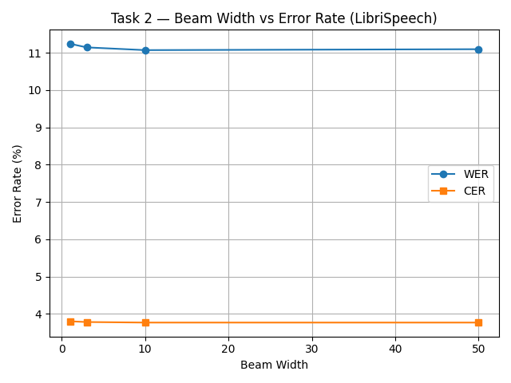
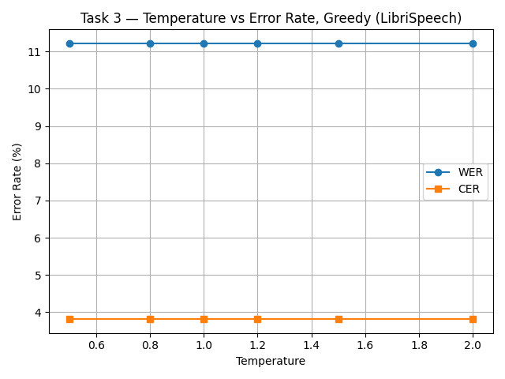
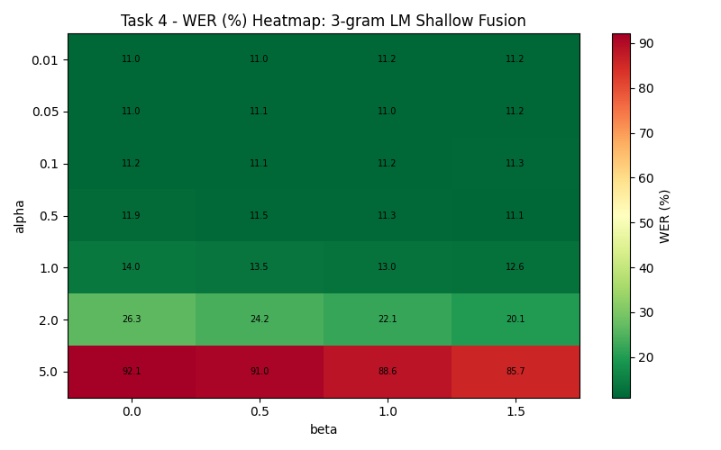
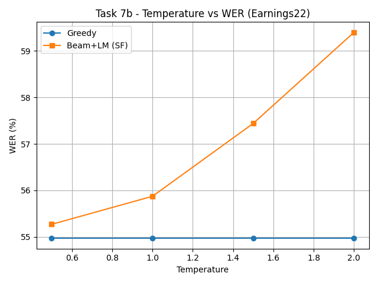
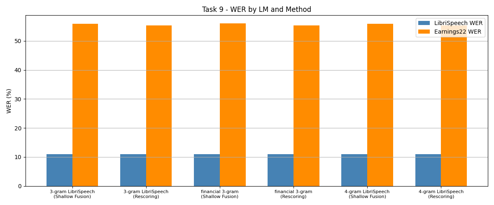

# Assignment 2: ASR Decoding — Report

*Trifonov Sergey, ITMO, AI Talent Hub*


## Overview

This report presents the results of implementing and evaluating **4 CTC decoding strategies** for the pre-trained acoustic model [`facebook/wav2vec2-base-100h`](https://huggingface.co/facebook/wav2vec2-base-100h), trained on 100 hours of LibriSpeech data.

**Evaluation datasets:**
- **LibriSpeech test-other** (in-domain) — 200 samples
- **Earnings22 test** (out-of-domain, financial earnings calls) — 200 samples

**Metrics:** Word Error Rate (WER) and Character Error Rate (CER), computed via [jiwer](https://jitsi.github.io/jiwer/).

---

## Part 1 — CTC Decoding

### Task 1 — Greedy Decoding

Greedy decoding selects the most probable token at each time step, then collapses repeated tokens and removes blanks (CTC collapse).

| Metric | Result | Reference |
|--------|--------|-----------|
| WER    | **11.22%** | ~10.4% |
| CER    | **3.81%**  | ~3.5%  |

Values are slightly above the reference, which is expected given the simplicity of greedy decoding and the relatively small acoustic model (100h training data).

---

### Task 2 — Beam Search Decoding

Beam search maintains multiple hypotheses in parallel using the prefix beam search algorithm with blank/non-blank probability tracking.

**Full evaluation (beam_width=10):**

| Metric | Greedy | Beam (width=10) | Improvement |
|--------|--------|------------------|-------------|
| WER    | 11.22% | **11.07%**       | -0.15%      |
| CER    | 3.81%  | **3.77%**        | -0.04%      |

**Beam width sweep:**

| beam_width | WER     | CER    |
|------------|---------|--------|
| 1          | 11.24%  | 3.80%  |
| 3          | 11.15%  | 3.78%  |
| **10**     | **11.07%** | **3.77%** |
| 50         | 11.10%  | 3.77%  |



**Analysis:** Beam search provides a modest improvement over greedy decoding. The optimal beam width is **10** — increasing to 50 yields no further gain (and even slightly increases WER). This suggests that for this model and dataset, the top-10 hypotheses already capture the best path. The diminishing returns are typical: wider beams add computational cost without meaningful quality improvement when the acoustic model is well-calibrated.

---

### Task 3 — Temperature Scaling

Temperature scaling divides logits by T before softmax: `logits = logits / T`. T < 1 sharpens the distribution (more confident), T > 1 flattens it (less confident).

| Temperature | WER     | CER    |
|-------------|---------|--------|
| 0.5         | 11.22%  | 3.81%  |
| 0.8         | 11.22%  | 3.81%  |
| 1.0         | 11.22%  | 3.81%  |
| 1.2         | 11.22%  | 3.81%  |
| 1.5         | 11.22%  | 3.81%  |
| 2.0         | 11.22%  | 3.81%  |



**Analysis:** Temperature has **zero effect** on greedy decoding. This is mathematically expected: greedy decoding uses `argmax`, which is invariant to monotonic scaling of logits. Dividing all logits by T does not change which token has the highest value — only the magnitude of the difference changes. The resulting curve is perfectly flat, confirming correct implementation. Temperature only becomes relevant when probabilities (not just rankings) matter — i.e., in beam search with LM fusion (see Task 7b).

---

## Part 2 — Language Model Integration

### Task 4 — Shallow Fusion with 3-gram LM

Shallow fusion integrates the KenLM language model score during beam search:

```
score = log_p_acoustic + alpha * log_p_lm + beta * num_words
```

**Alpha/beta sweep results:**

| alpha \ beta | 0.0    | 0.5        | 1.0    | 1.5    |
|--------------|--------|------------|--------|--------|
| **0.01**     | 11.05% | **10.99%** | 11.20% | 11.24% |
| **0.05**     | 11.02% | 11.12%     | 11.05% | 11.22% |
| **0.1**      | 11.22% | 11.12%     | 11.17% | 11.34% |
| **0.5**      | 11.88% | 11.49%     | 11.32% | 11.12% |
| **1.0**      | 13.96% | 13.52%     | 13.03% | 12.59% |
| **2.0**      | 26.28% | 24.15%     | 22.10% | 20.09% |
| **5.0**      | 92.10% | 91.03%     | 88.58% | 85.68% |



**Best configuration:** `alpha=0.01, beta=0.5` -> **WER=10.99%, CER=3.75%**

| Metric | Greedy | Beam   | Beam + 3-gram (SF) | Reference |
|--------|--------|--------|---------------------|-----------|
| WER    | 11.22% | 11.07% | **10.99%**          | ~9.7%     |
| CER    | 3.81%  | 3.77%  | **3.75%**           | ~3.4%     |

**Analysis:**

- The optimal alpha is very small (0.01), confirming that the acoustic model is already strong in-domain and the LM should provide only gentle guidance.
- At alpha >= 1.0, WER degrades rapidly as the LM begins to override acoustic evidence.
- At alpha=5.0, WER reaches 85–92% — the LM completely dominates, generating linguistically plausible but acoustically incorrect text.
- Beta (word insertion bonus) has a moderate effect: small positive beta (0.5) helps by preventing the model from merging or dropping words.

---

### Task 5 — 4-gram LM

Using the best alpha/beta from Task 4 with the larger 4-gram LM:

| LM              | alpha | beta | WER     | CER    |
|-----------------|-------|------|---------|--------|
| 3-gram (pruned) | 0.01  | 0.5  | 10.99%  | 3.75%  |
| **4-gram**      | 0.01  | 0.5  | **11.02%** | **3.75%** |

**Analysis:** The 4-gram LM provides virtually no improvement over the 3-gram on LibriSpeech. This is because:
1. The acoustic model is already well-calibrated on this domain, so LM influence is minimal (alpha=0.01)
2. At such low alpha, the difference between 3-gram and 4-gram context is negligible
3. The pruned 3-gram already captures the most important language patterns for this domain

---

### Task 6 — LM Rescoring

Second-pass rescoring applies LM scores to the complete beam hypotheses after acoustic-only beam search, rather than during search.

**Alpha/beta sweep:**

| alpha \ beta | 0.0    | 0.5    | 1.0    | 1.5        |
|--------------|--------|--------|--------|------------|
| **0.01**     | 11.07% | 11.02% | 11.10% | **10.99%** |
| **0.05**     | 11.07% | 11.02% | 11.10% | 10.99%     |
| **0.1**      | 11.07% | 11.02% | 11.10% | 10.99%     |
| **0.5**      | 11.22% | 11.07% | 11.02% | 11.07%     |
| **1.0**      | 11.34% | 11.07% | 10.99% | 11.10%     |
| **2.0**      | 11.51% | 11.37% | 11.27% | 11.07%     |
| **5.0**      | 12.12% | 11.83% | 11.81% | 11.68%     |

**Best configuration:** `alpha=0.01, beta=1.5` -> **WER=10.99%, CER=3.74%**

**Rescoring vs Shallow Fusion — stability comparison:**

| alpha | SF WER  | RS WER  | Difference |
|-------|---------|---------|------------|
| 0.01  | 11.0%   | 11.0%   | ~0%        |
| 0.5   | 11.9%   | 11.2%   | -0.7%      |
| 1.0   | 14.0%   | 11.3%   | **-2.7%**  |
| 2.0   | 26.3%   | 11.5%   | **-14.8%** |
| 5.0   | 92.1%   | 12.1%   | **-80.0%** |

**Key finding:** Rescoring is **dramatically more stable** than shallow fusion at high alpha values. At alpha=5.0, SF produces 92% WER while RS degrades only to 12%. This is because:
- **SF** injects LM scores at every beam search step, distorting the search path — high alpha causes the beam to follow linguistically probable but acoustically wrong paths, and these errors compound over time
- **RS** applies LM only after beam search completes — the acoustic beam search is unaffected, so even a strong LM can only rerank among acoustically plausible hypotheses

#### Qualitative Comparison

10 samples where at least one LM method changed the hypothesis vs plain beam search:

**Example 1 — Word boundary fix (SF and RS both help):**
```
REF:  the kick he had received was a foretaste of what he might expect...
BEAM: the kickhe had received was a foretaste of what he might expect...
SF:   the kick he had received was a fore taste of what he might expect...
RS:   the kick he had received was a fore taste of what he might expect...
```
SF and RS fix the merged "kickhe" → "kick he", but introduce a new split: "foretaste" → "fore taste".

**Example 2 — RS preserves, SF introduces error:**
```
REF:  then as archy stood in the dark literally aghast...
BEAM: then as archi stood in the dark literally aghased...
SF:   then as arche stood in the dark literally a ghased...    [error]
RS:   then as archi stood in the dark literally aghased...     [same]
```
SF changes "archi" to "arche" and splits "aghased" → "a ghased" — making things worse. RS is conservative and keeps the beam hypothesis.

**Example 3 — Compound word separation:**
```
REF:  ...jerry nandy's lobster boat coming into the cove...
BEAM: ...jerry nandy's lobsterboat coming into the cove...
SF:   ...jerry nandy's lobster boat coming into the cove...    [corrected]
RS:   ...jerry nandy's lobster boat coming into the cove...    [corrected]
```
Both methods correctly split "lobsterboat" → "lobster boat".

**Example 4 — Rare proper names remain unfixed:**
```
REF:  ...mister gurr to be talking like that to andrew teal...
BEAM: ...mister gurver to be talking like that to andreuteal...
SF:   ...mister gurver to be talking like that to andreu teal...
RS:   ...mister gurver to be talking like that to andreuteal...
```
Neither method fixes "gurver" → "gurr" (rare proper name outside LM vocabulary). SF splits "andreuteal" but still has "andreu" instead of "andrew".

**Patterns observed:**
- **LM fixes:** word boundary errors (merged/split words), common word substitutions
- **LM fails on:** rare proper names (archy, gurr), phonetically ambiguous words (aghast/aghased), domain-specific vocabulary
- **SF vs RS disagreement:** SF is more aggressive — it sometimes fixes errors but also introduces new ones. RS is conservative and safer, rarely making things worse

---

## Part 3 — Domain Shift Analysis

### Task 7 — All Methods on Both Test Sets

| Method                    | LibriSpeech WER | LibriSpeech CER | Earnings22 WER | Earnings22 CER |
|---------------------------|-----------------|-----------------|----------------|----------------|
| Greedy                    | 11.22%          | 3.81%           | **54.97%**     | 25.58%         |
| Beam search               | 11.07%          | 3.77%           | 54.94%         | 25.38%         |
| Beam + 3-gram (SF)        | **10.99%**      | 3.75%           | 55.87%         | 25.49%         |
| Beam + 3-gram (RS)        | **10.99%**      | **3.74%**       | 55.33%         | 25.38%         |

**Domain shift analysis:**

The WER gap between LibriSpeech (~11%) and Earnings22 (~55%) is **~5x**, demonstrating severe domain mismatch. The acoustic model was trained on LibriSpeech (read audiobooks) and encounters completely different characteristics in financial earnings calls:
- Spontaneous speech with disfluencies ("uh", "um", fillers)
- Financial terminology ("EBITDA", "basis points", "year-over-year")
- Speaker accents and telephone audio quality
- Informal sentence structure vs. polished book narration

**Why does the LibriSpeech LM provide no benefit on Earnings22?**

The LM actually **hurts** performance on Earnings22: SF increases WER from 54.94% to 55.87% (+0.93%). The LibriSpeech LM was trained on book text and assigns high probability to literary phrases and low probability to financial jargon. When the acoustic model is already uncertain on out-of-domain speech, adding an out-of-domain LM pushes hypotheses further in the wrong direction.

---

### Task 7b — Temperature Sweep on Earnings22

| Temperature | Greedy WER | Beam+LM (SF) WER |
|-------------|------------|-------------------|
| 0.5         | 54.97%     | **55.27%**        |
| 1.0         | 54.97%     | 55.87%            |
| 1.5         | 54.97%     | 57.44%            |
| 2.0         | 54.97%     | **59.40%**        |



**Analysis:**

- **Greedy** remains perfectly flat (as in Task 3) — temperature does not affect argmax
- **SF degrades sharply** with increasing temperature: from 55.27% (T=0.5) to 59.40% (T=2.0), a **+4.13% increase in WER**

**Why does higher T hurt LM fusion on out-of-domain speech?**

Higher temperature flattens the acoustic distribution, making the model "less confident" about its predictions. This gives more relative weight to the LM score in the combined scoring function. On LibriSpeech (Task 3), this effect was invisible because: (a) greedy doesn't use probabilities, only argmax; (b) with LM fusion, the in-domain LM would provide correct guidance. On Earnings22, the out-of-domain LM provides **incorrect** guidance — flattening the acoustic scores amplifies this harmful influence.

**Is the acoustic model well-calibrated on Earnings22?**

No. The acoustic model was never trained on financial speech, so its confidence is unreliable. At T=1.0, it may already be overconfident on wrong predictions (e.g., predicting a literary word when a financial term was spoken). Lowering T (e.g., 0.5) slightly improves SF because it makes the acoustic model *more* confident, reducing the relative LM contribution — which is beneficial when the LM is out-of-domain.

---

### Task 8 — Financial-Domain KenLM

A 3-gram KenLM model was trained on `data/earnings22_train/corpus.txt` (~5,000 lines, ~100K words of financial earnings call transcripts):

```bash
lmplz -o 3 --discount_fallback < data/earnings22_train/corpus.txt > financial-3gram.arpa
```

The resulting model contains 5,701 unigrams, 42,688 bigrams, and covers basic financial vocabulary.

---

### Task 9 — All LMs on Both Test Sets

| LM                  | Method          | LibriSpeech WER | LibriSpeech CER | Earnings22 WER | Earnings22 CER |
|---------------------|-----------------|-----------------|-----------------|----------------|----------------|
| 3-gram LibriSpeech  | Shallow Fusion  | 10.99%          | 3.75%           | 55.87%         | 25.49%         |
| 3-gram LibriSpeech  | Rescoring       | 10.99%          | 3.74%           | 55.33%         | 25.38%         |
| financial 3-gram    | Shallow Fusion  | 11.02%          | 3.75%           | 56.02%         | 25.51%         |
| financial 3-gram    | Rescoring       | 10.99%          | 3.74%           | **55.27%**     | **25.38%**     |
| 4-gram LibriSpeech  | Shallow Fusion  | 11.02%          | 3.75%           | 55.93%         | 25.49%         |
| 4-gram LibriSpeech  | Rescoring       | 10.99%          | 3.74%           | 55.33%         | 25.38%         |



**Which LM works best in-domain?**

All LMs perform nearly identically on LibriSpeech (~11.0% WER). The acoustic model is so well-calibrated in-domain that the LM choice barely matters. The optimal alpha (0.01) means LM influence is minimal.

**Which LM works best out-of-domain?**

The **financial 3-gram with rescoring** achieves the best Earnings22 WER (**55.27%**), but the improvement over the LibriSpeech 3-gram with rescoring (55.33%) is only **0.06%** — practically negligible.

**Does domain-matched LM help more than a larger general LM?**

In this experiment, **no**. The financial 3-gram and 4-gram LibriSpeech give nearly identical results. This is likely because:

1. **Small training corpus:** The financial corpus (~100K words) is too small to build a robust 3-gram model. Many financial n-grams appear only once or not at all, leading to heavy backoff
2. **Low alpha:** The alpha values were optimized on LibriSpeech. On Earnings22, a higher alpha for the financial LM might yield better results since it's domain-matched
3. **Vocabulary gap:** The wav2vec2 character-level vocabulary handles OOV words, but the financial LM's limited vocabulary means many domain-specific terms get poor LM scores
4. **Rescoring limitation:** Rescoring can only rerank hypotheses from acoustic beam search — if the correct financial term wasn't in the beam to begin with, no LM can recover it

To see meaningful improvement from domain-matched LM, one would need a significantly larger financial corpus (millions of words) and a separate alpha/beta sweep optimized for the financial domain.
